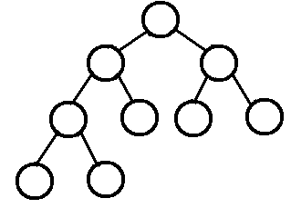
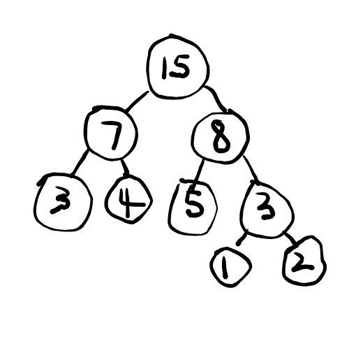

# A Guide to NOI for Beginners (Draft)

By: Si Chenglei 

Email: sichenglei1125@gmail.com

Github: https://github.com/NoviScl/NOI

Reference Book: http://www.ituring.com.cn/book/1044

Practice Solutions: https://github.com/yogykwan/acm-challenge-workbook/tree/master/src


## Foreword

This guide is designed specifically for those who already learned the basics of programming. I assume that you already know how to code in C++ and understand the concept of time complexity, as well as some other basic data structures like linked list, stack, queue, BST. (If not, there are lots of great tutorials/MOOCs online.)  

We understand that it is hard to teach oneself competitive programming. So I made this guide and recorded a series of videos explaining it. This guide is meant for you to quickly get started on solving NOI problems and get familiar with some important algorithms. There is no guarantee that you can get a medal at NOI after reading this. But I am sure you can improve your knowledge and problem solving skills if you read this guide carefully and do lots of practice for every topic. Feel free to contact me if you find any mistakes or have doubts, I am always happy to discuss with you.


## 1. Time Complexity

One important thing in NOI is time complexity. There is always a time limit for the problems and if your algorithm is too slow, you will get Time Limit Exceeded (TLE). 

Usually the time limit is 1 second. You can substitute the maximum possible number of data witin the given range to yur algorithm's time complexity to get an exstimated number of operations needed. For example, if your algorithm is O($n^2$) and the data range is $n \leq 1000$, then the max operations needed is around $10^6$. The number of operations can be done in 1 second is around $10^9$.  So:

* $\leq 10^9$: no problem
* $>10^9$: probably TLE (but I've seen exceptions...)


Now we will use a simple example to see how this works in practice.

##### <u>E.g.1  Pick Numbers</u>

You are given $n$ different integers $k_1, … , k_n$. You need to pick 4 numbers from them. You can pick the same number any times. If the sum of the 4 numbers you pick is $m$, you output YES, otherwise output NO.

 $1 \leq n \leq 1000$,  $1 \leq m \leq 10^8$, $1 \leq k_i \leq 10^8$ 


Solution 1: Brute Force

```cpp
#include <cstdio>
using namespace std;

const int MAX_N = 1002;

int main(){
	int n, m, k[MAX_N];

	scanf("%d %d", &n, &m);
	for(int i=0; i<n; i++){
		scanf("%d", &k[i]);
	}

	bool f = false;

	// brute force all possibilities
	for(int a=0; a<n; a++){
		for(int b=0; b<n; b++){
			for(int c=0; c<n; c++){
				for(int d=0; d<n; d++){
					if(k[a] + k[b] + k[c] + k[d] == m){
						f = true;
					}
				}
			}
		}
	}

	if(f) printf("YES");
	else printf("NO");
}
```


The complexity for this solution is $O(n^4)$, so the estimated number of operations is $10^{12}$, which will definitely get you TLE. 

One way to improve it: when you have chosen the first three numbers, you also know what the last number should be in order for the sum to be $m$. Hence you can use binary search to fund the desired number.

Solution 2: Binary Search the last number

```cpp
#include <cstdio>
#include <algorithm>
using namespace std;

const int MAX_N = 1002;

int n, m, k[MAX_N];

bool binary_search(int x){
	int l=0, r=n;

	while(r-l>=1){
		int i = (l+r)/2;
		if(k[i]==x) return true;
		else if(k[i]<x) l = i+1;
		else r = i;
	}

	return false;
}

void solve(){
	//must sort before BS
	sort(k, k+n);

	bool f = false;

	for(int a=0; a<n; a++){
		for(int b=0; b<n; b++){
			for(int c=0; c<n; c++){
				if(binary_search(m-k[a]-k[b]-k[c])){
					f = true;
				}
			}
		}
	}

	if(f) printf("YES");
	else printf("NO");
}
```


The complexity is now improved to $O(n^3 \log n)$. But this is still too slow. 

One way to improve: when we have chosen the first two numbers, we also know the sum of the other two numbers in order to get a total sum of $m$. Hence, we can binary search among all possible sums of two given numbers to find if the desired sum is present.

Solution 3: Binary Search the sum of the last two numbers

```cpp
#include <cstdio>
#include <algorithm>
using namespace std;

const int MAX_N = 1002;

int n, m, k[MAX_N];

// sum of two numbers
int kk[MAX_N * MAX_N];

void solve(){
	for(int c=0; c<n; c++){
		for(int d=0; d<n; d++){
			kk[c*n + d] = k[c] + k[d];
		}
	}

	sort(kk, kk+n*n);

	bool f = false;
	for(int a=0; a<n; a++){
		for(int b=0; b<n; b++){
			// use STL BS
			if(binary_search(kk, kk+n*n, (m-k[a]-k[b]))){
				f = true;
			}
		}
	}

	if(f) printf("YES");
	else printf("NO");
}
```


Complexity:  sorting $n^2$ numbers: O($n^2 \log n$) ,  nested loop with binary search: O($n^2 \log n$)

So overall complexity is: O($n^2 \log n$), which is acceptable.


## 2. Search

#### 2.1 Recursion with Memoization

Naive recursion is often slow because it computes the same elements many times, which is a waste of time. For example, when calcuating the fibonacci number, we compute fib(8) and fib(9) to get fib(10). However, while computing fib(9), we need to compute fib(8) again.

One way to avoid this is to store all computed values in a table for future use. This technique is called memoization.

Example: Fibonacci number

```cpp
int memo[MAX_N + 1] = {0};

int fib(int n){
	if(n<=1) return n;
	if(memo[n]!=0) return memo[n];
	return memo[n] = fib(n-1) + fib(n-2);
}
```


#### 2.2 Stack

Stack is already implemented in STL. 

To use Stack in STL:

```cpp
#include <stack>
#include <cstdio>
using namespace std;

int main(){
	stack<int> s;
	s.push(2);
	s.push(3);
	printf("%d\n", s.top()); //3
	s.pop();
	printf("%d\n", s.top()); //2
}
```


#### 2.3 Queue

To use Queue in STL:

```cpp
#include <queue>
#include <cstdio>
using namespace std;

int main(){
	queue<int> que;
	que.push(1);
	que.push(2);
	printf("%d\n", que.front()); //1
	que.pop();
	printf("%d\n", que.front()); //2
}
```


#### 2.4 Depth-first Search (DFS)

We use a binary tree to illustrate DFS.



DFS starts from the root and goes all the way down to the leftmost leaf node, then returns back to the previous layer, travels through the second leaf node, then returns back to the previous layer, and so on.

DFS is usually implemented by recursion.

<u>**E.g.1  Sum**</u>

You are given $n$ integers $a_1, .., a_n$ , determine if it is possible to choose some of them (each number can only be used once) so that their sum is $k$.

$1 \leq n \leq 20,  -10^8 \leq a_i \leq 10^8,  -10^8 \leq k \leq10^8$


Since for each given number, we can choose to either take or not take, this is essentially searching through a binary tree.

```cpp
const int MAX_N = 21;
int a[MAX_N];
int n, k;

bool dfs(int i, int sum){
	// leaf node, note n not (n-1)
	if(i==n) return sum == k;

	// not take a[i]
	if(dfs(i+1, sum)) return true;
	
	// take a[i]
	if(dfs(i+1, sum+a[i])) return true;

	return false;
}

void solve(){
	if(dfs(0, 0)) printf("YES");
	else printf("NO");
}
```

Total possible cases (number of leaf nodes) is $2^{n+1}$,  so complexity $O(2^n)$.


<u>**E.g.2  Lake Counting (POJ 2386)**</u>

Given a $N*M$ field, some areas some water after a rain  ('W' : water, ' . ' : normal land).  Connected areas with water (including diagonally adjacent) are counted as one puddle. Output the number of pubbles in the field.

$N, M \leq 100$


Starting from one area with water, we can use DFS to find all areas with water connected with this area. We count the number of such connected puddles while setting already counted areas to normal to avoid repetition.

```cpp
const int MAX_N = 101;
int N, M;
char field[MAX_N][MAX_N];

void dfs(int x, int y){
	// change this area to normal
	field[x][y] = '.';

	// check all 8 adjacent areas
	for(int dx=-1; dx<=1; dx++){
		for(int dy=-1; dy<=1; dy++){
			int nx = x + dx, ny = y + dy;
			if(nx>=0 && nx<N && ny>=0 && ny<M && field[nx][ny]=='W')
				dfs(nx, ny);
		}
	}
}

void solve(){
	int res = 0;
	for(int i=0; i<N; i++){
		for(int j=0; j<M; j++){
			if(field[i][j] == 'W'){
				dfs(i, j);
				res++;
			}
		}
	}

	printf("%d\n", res);
}
```

Since every area is only searched once (after once water is set to normal and won't be searched again), time complexity is $O(N*M)$. 


#### 2.5 Breadth-first Search (BFS)

We use a binary tree to illustrate BFS.


BFS searches from the nearest nodes to the farthest nodes. In the binary tree example, starting from the root, BFS first goes to the two nodes on the next layer which are the closest to it. Then it goes to the nodes on the third layer, and so on. BFS is usually implemented by queue.

<u>**E.g.1  Maze Runner**</u>

You are given a $N*M$ maze consisting of obstacles and normal lands. ('#' : obstacle, ' . ' : land, 'S': starting point, 'G': goal ). Each step you can move left, right, up or down. Find the minimum number of steps needed from starting point to the goal.

$N, M \leq 100$


```cpp
const int MAX_N = 101;
const int INF = 9999999;

typedef pair<int, int> P;

char maze[MAX_N][MAX_N];
int N, M;
int sx, sy;  //start pt
int gx, gy;  //goal pt

int d[MAX_N][MAX_N];

int dx[4] = {1, 0, -1, 0}, dy[4] = {0, 1, 0, -1};

int bfs(){
	queue<P> que;

	for(int i=0; i<N; i++){
		for(int j=0; j<N; j++){
			d[i][j] = INF;
		}
	}

	que.push(P(sx, sy));
	d[sx][sy] = 0;

	while(que.size()){
		P cur = que.front();
		que.pop();
		
		if(cur.first==gx && cur.second==gy) break;

		for(int i=0; i<4; i++){
			int nx = cur.first + dx[i], ny = cur.second + dy[i];

			// available and not visited
			if(nx>=0 && nx<N && ny>=0 && ny<M && maze[nx][ny]!='#' && d[nx][ny]==INF){
				que.push(P(nx, ny));
				d[nx][ny] = d[cur.first][cur.second] + 1;
			}
		}
	}

	return d[gx][gy];
}


void solve(){
	int res = bfs();
	printf("%d\n", res);
}
```

Each point in the maze has entered the queue **at most** once. Hence complexity is $O(N*M)$.


#### 2.6 Pruning and Backtracking 

In DFS, if at a certain state we realize that this state will definitely not generate a correct answer, then we do not need to continue with this state any more, we can just seach the next possible state instead. This is called pruning.

Usually DFS is used to search for solution over a tree structure. Generally, this algorithm can be used to search over any problem space and it is called backtracking.

Example: Find all permutations of N numbers

```cpp
int total = 0;  //#permutations
const int N = 4;  //use 4 as an example
int numbers[N], used[N], res[N];

void permutate(int ith){
	if(ith==N){
		for(int i=0; i<N; i++){
			cout<<res[i];
		}
		cout<<endl;
		total++;
		return;
	}

	// find availble numbers
	for(int i=0; i<N; i++){
		if(!used[i]){
			res[ith] = nums[i];
			used[i] = 1;
			permutate(ith+1);
			//set free for future use
			used[i]=0;
		}
	}
}

int main(){
	for(int i=0; i<N; i++){
		cin>>nums[i];
	}
	memset(used, 0, sizeof(used));
	permutate(0);
	cout<<total;
}
```


For permutation, it might be easier to directly use next_permutation function. Note that you should use do while in this case, otherwise you will miss the original array case.

Example: next_permutation

```cpp
#include <algorithm>
#include <iostream>
using namespace std;

const int N = 4;
int nums[N] = {1, 2, 3, 4}, total=0;

int main(){
    do{
        total++;
        for(int i=0; i<N; i++){
            cout<<nums[i];
        }
        cout<<endl;
    }while(next_permutation(nums, nums+N));
    cout<<total;  //24
}
```


(Practice list: refer to the recommended repo)


## 3. Greedy Algorithm

In greedy algorithm, we choose the current best solution at each step. 

**<u>E.g.1  Job Arrangement</u>**

There are $n$ jobs, each job starts from time $s_i$ and ends at time $t_i$ . If you choose a job, you must not do any other jobs during its full period (including $s_i$ and $t_i$). Find the maximum number of jobs you can do.

$1 \leq N \leq 10^5,  1 \leq s_i \leq t_i \leq 10^9$


Intuition: we want to finish the current job as early as possible so that we have more time for other jobs. Every time we choose the job with the earliest ending time and not clashing with previously chosen jobs.

```cpp
const int MAX_N = 100002;

int N, S[MAX_N], T[MAX_N];

pair<int, int> jobs[MAX_N];

void solve(){
	// sorts the first element in pair by default
	// should sort by end time
	for(int i=0; i<N; i++){
		jobs[i].first = T[i];
		jobs[i].second = S[i];
	}

	sort(jobs, jobs+N);

	// t: end time of prev chosen job
	int ans=0, t=0;
	for(int i=0; i<N; i++){
		if(t < jobs[i].second){
			ans++;
			t = jobs[i].first;
		}
	}

	printf("%d\n", ans);
}
```

Rigorous proofs of the correctness of the algorithm are possible but will not be covered here.


**<u>E.g.2  Smallest String  (POJ 3617)</u>**

Given a string $S$ with length $N$ (all characters are uppercase), and an empty string $T$. Every time you can either remove the first or last character from $S$ and append to the end of $T$. Construct the $T$ with the minimum alphabetic order. 

$1 \leq N \leq 2000$


Intuition: everytime choose the smaller character from the first and last character of $S$ . If they are the same, compare the next character, do so until there is a difference (if all equal then doesn't matter).

(Consider a simple example: zabz).

```cpp
const int MAX_N = 2002;
int N;
char S[MAX_N + 1];

void solve(){
	int count = 0;
	int a = 0, b = N - 1;

	while(a<=b){
		bool left = false;

		for(int i=0; a+i<=b-i; i++){
			if(S[a+i] < S[b-i]){
				left = true;
				break;
			}
			else if(S[a+i] > S[b-i]){
				left = false;
				break;
			}
		}

		if(left) putchar(S[a++]);
		else putchar(S[b--]);
		count++;
		if(count%80==0) putchar('\n');  
	}
}
```


**<u>E.g.3  Fence Repair  (POJ 3253)</u>**

You need to cut a board into $N$ pieces, with lengths $L_1, …, L_N$. The sum of all the cut boards should be the same of the original board. The cost of cutting a board into 2 pieces equals to the length of the board. For example, if you want to cut a board with length 21 into boards with lengths 5, 8, 8, you can first cut it into 13 and 8 (cost: 21), then cut 12 into 5 and 8 (cost: 13). 

Find the minimum cost of cutting the board.

$1 \leq N \leq 2*10^4,  0 \leq L_i \leq 5*10^4$





Intuition: Cutting the board is like splitting the node into two child nodes. The total cost is the sum of all non-leaf nodes, which also equals to the sum of (leaf node value)*(leaf node depth). Therefore, to get minimum total cost, we want the least value leaf nodes to have the largest depth. 

Suppose we already have the cut boards $L_1, .., L_N$, then the shortest and second shorted board (suppose they are $L_1, L_2$) should be brothers (note it is impossible for a node to have only one child node) and from the same parent node. Then we replace them with $(L_1+L_2)$ and continue the process until there is only one board left.

```cpp
typedef long long ll;

int N, L[MAX_N];

void solve(){
	ll ans = 0;

	while(N > 1){
		int min1=0, min2=1;
		// min1: shortest, min2: second shortest
		if(L[min1] > L[min2]) swap(min1, min2);

		for(int i=2; i<N; i++){
			if(L[i] < L[min1]){
				min2 = min1;
				min1 = i;
			}
			else if(L[i] < L[min2]){
				min2 = i;
			}
		}

		int t = L[min1] + L[min2];
		ans += t;

		// replace min1 with t
		// swap min2 with last ele and del it
		if(min1 == N-1) swap(min1, min2);
		L[min1] = t;
		L[min2] = L[N-1];
		N--;
	}

	printf("%lld\n", ans);
}
```

Complexity O($n^2$). This can be further improved with priority queue (every time pop two front, push their sum).

```cpp
typedef long long ll;

int N, L[MAX_N];

void solve(){
	ll ans = 0;

	// small root heap
	priority_queue<int, vector<int>, greater<int> > que; 

	for(int i=0; i<N; i++){
		que.push(L[i]);
	}

	while(que.size() > 1){
		int l1, l2;
		l1 = que.top();
		que.pop();
		l2 = que.top();
		que.pop();

		ans += l1+l2;
		que.push(l1+l2);
	}

	printf("%lld\n", ans);
}
```

Complexity: O($N \log N$)


## 4. Dynamic Programming 

There are two approaches, top-down (recursion), bottom-up (iteration). I find it best to explain DP with examples. Most examples I list here are must-know for NOI.

**<u>E.g.1  0-1 Knapsack</u>**

You have $n$ items each with weight $w_i$ and value $v_i$. Your bag has max wieght capacity $W$. Find the max value of items that can be put in the bag.

$1 \leq n \leq 100,  1 \leq w_i, v_i \leq 100,  1 \leq W \leq 10^4$


Let dp(i, j) denote the max value the bag can have using only the first $i$ items and with capacity j. 

For each item, we either take or do not take (if capcacity ). So we can just choose the max from those two options.

Top-down: recursion with memoisation

```cpp
const int MAX_N = 102;
const int MAX_W = 10002;

int dp[MAX_N][MAX_W];

int rec(int i, int j){
	if(dp[i][j]>=0){
		return dp[i][j];
	}

	int res;
	// end case
	if(i==0){
		res = 0;
	}
	// can't take w[i]
	else if(j < w[i]){
		res = rec(i-1, j);
	}
	// j>=w[i]
	else{
		res = max(rec(i-1, j), rec(i-1, j-w[i])+v[i]);
	}

	return dp[i][j]=res;
}

void solve(){
	memset(dp, -1, sizeof(dp));
	printf("%d\n", rec(N, W));
}
```


In the bottom-up approach, we fill up the dp table in order.

(Note: sometimes I start from index 1 when inputing data.)

```cpp
int dp[MAX_N][MAX_W];

void solve(){
  	// no item or no capacity: 0
	memset(dp, 0, sizeof(dp));

	for(int i=1; i<=N; i++){
		for(int j=1; j<=W; j++){
			if(j < W[i]){
				dp[i][j] = dp[i-1][j];
			}
			else{
				dp[i][j] = max(dp[i-1][j], dp[i-1][j-w[i]]+v[i]);
			}
		}
	}
}
```

Complexity: O($nW$)

We can see the that the most important part of DP is to identify the subproblem states and update equations.

In this problem, the subproblem state is the range of items available and the capacity. The update equations can then be deduced easily.

We can save some space by using a rolling array. 

```cpp
int dp[MAX_W + 1];

void solve(){
  	memset(dp, 0, sizeof(dp));
	for(int i=1; i<=n; i++){
		for(int j=W; j>=w[i]; j--){
			dp[j] = max(dp[j], dp[j-w[i]]+v[i]);
		}
	}
	printf("%d\n", dp[W]);
}
```

Note that we need to go from right to left in the inner loop in order to use the values from previous $i$.


**<u>E.g.2  Longest Common Subsequence (LCS)</u>**

Find the length of the longest common subsequence of two string. For example, the LCS of 'abcd' and 'becd' is 'bcd'.

String length: $1 \leq n,m \leq 1000$

Let dp(i, j) denote the length of LCS of substrings $s_1…s_i$ and $t_1…t_j$. 

If $s_i=t_j$: dp(i, j) = max(dp(i-1, j-1)+1, dp(i-1, j),  dp(i,  j-1))

Else: dp(i, j) = max(dp(i-1,  j),  dp(i,  j-1))

```cpp
int n, m;
char s[MAX_N], t[MAX_M];

int dp[MAX_N+1][MAX_M+1];

void solve(){
	memset(dp, 0, sizeof(dp));
	for(int i=1; i<=n; i++){
		cin>>s[i];
	}
	for(int i=1; i<=m; i++){
		cin>>t[i];
	}

	for(int i=1; i<=MAX_N; i++){
		for(int j=1; j<=MAX_M; j++){
			dp[i][j] = max(dp[i-1][j], dp[i][j-1]);
			if(s[i]==t[j]){
				dp[i][j] = max(dp[i][j], dp[i-1][j-1]+1);
			}
		}
	}

	cout<<dp[n][m];
}
```


**<u>E.g.3  Unbounded Knapsack</u>**

You have $n$ types of items each with weight $w_i$ and value $v_i$. Your bag has max wieght capacity $W$. Find the max value of items that can be put in the bag. Note that you can take unlimited number of copies of each type of item.

$1 \leq n \leq 100,  1 \leq w_i, v_i \leq 100,  1 \leq W \leq 10^4$


In this case, we need to add another inner loop to find the best number of copies to take within the capacity. 

```cpp
int dp[MAX_N + 1][MAX_W + 1];

void solve(){
	memset(dp, 0, sizeof(dp));

	for(int i=1; i<=n; i++){
		for(int j=1; j<=W; j++){
			for(int k=0; k*w[i]<=j; k++){
				dp[i][j] = max(dp[i][j], dp[i-1][j - k*w[i]] + k*v[i]);
			}
		}
	}
	printf("%d\n", dp[n][W]);
}
```


Complexity: O($nW^2$)

We can further improve this algorithm. Note that choosing $k$ in $dp[i][j]$ is the same as choosing $(k-1)$ in $dp[i][j-w[i]]$ (take one copy of $i$th item). Hence we can use this to reduce repeated calculation.

$dp[i][j]$

$=\max \{dp[i-1][j-k*w[i]]+k*v[i] | k\geq 0 \}$

$=\max(dp[i][j], \max \{dp[i-1][j-k*w[i]]+k*v[i] | k \geq 1\})$  (either not take or take at least one)

$=\max(dp[i][j], \max \{dp[i-1][(j-w[i]) - k*w[i]]+k*v[i] | k \geq 0 \})$  (take out one from $k$)

$=\max(dp[i][j], dp[i][j-w[i]]+v[i] )$

(This can come from observation and intuition as well.)


```cpp
void solve(){
	memset(dp, 0, sizeof(dp));

	for(int i=1; i<=n; i++){
		for(int j=1; j<=W; j++){
			if(j<w[i]){
				dp[i][j] = dp[i-1][j];
			}
			else{
				dp[i][j] = max(dp[i-1][j], dp[i][j-w[i]]+v[i]);
			}
		}
	}
	printf("%d\n", dp[n][W]);
}
```


This can also be improved by using a rolling array.

```cpp
int dp[MAX_W + 1];

void solve(){
	memset(dp, 0, sizeof(dp));

	for(int i=1; i<=n; i++){
		for(int j=w[i]; j<=W; j++){
			dp[j] = max(dp[j], dp[j-w[i]]+v[i]);
		}
	}

	printf("%d\n", dp[W]);
}
```

Note that in the inner loop we go from left to right to use the computed values at this $i$ iteration.


**<u>E.g.4  0-1 Knapsack 2</u>**

You have $n$ items each with weight $w_i$ and value $v_i$. Your bag has max wieght capacity $W$. Find the max value of items that can be put in the bag.

$1 \leq n \leq 100,  1 \leq w_i \leq 10^7,  1 \leq v_i \leq 100, 1 \leq W \leq 10^9$


The difference of this problem with the first 0-1 knapsack is that the range for $w_i$ and $W$ become much larger and O($nW$) will get TLE.

Notice that the value of $v$ is rather small this time. Let dp(i, j) denote the minimum weight needed to get total value of $j$ choosing only from the first $i$ items. Similarly, for each item, we either take or do not take.

Our update equation will then be: $dp[i][j] = min(dp[i-1][j], dp[i-1][j-v[i]]+w[i])$

Note that when $i=0, j>0;  dp[i][j]=inf$,  where $inf$ is a very large number.

The final answer is then the maximum $j$ that makes $dp[i][j] \leq W$.

```cpp
const int INF = 99999999;
int dp[MAX_N + 2][MAX_N * MAX_V + 1];

void solve(){
	// memset only works for 0 and 1
	fill(dp[0], dp[0]+MAX_N*MAX_V+1, INF);
	dp[0][0] = 0;

	for(int i=1; i<=n; i++){
		for(int j=1; j<=MAX_N*MAX_V; j++){
			if(j<v[i]){
				dp[i][j]=dp[i-1][j];
			}
			else{
				dp[i][j]=min(dp[i-1][j], dp[i-1][j-v[i]]+w[i]);
			}
		}
	}

	int res=0;
	for(int i=0; i<=MAX_N*MAX_V; i++){
		if(dp[n][i]<=W) res=i;
	}
	printf("%d\n", res);
}
```

Complexity: O($n \sum_i v_i$)


**<u>E.g.5  Sum</u>**

Given $n$ different intergers $a_i$, each can be taken at most $m_i$ times. Determine if it's possible to choose among them so that their sum is $K$.

$1 \leq n \leq 100,  1 \leq a_i, m_i \leq 10^5,  1 \leq K \leq 10^5$


Let dp(i, j) denote the number of ways to choose only from the first $i$ numbers to get sum $j$ .

We have: $dp[i][j]= \sum dp[i-1][j-k*a_i],  0 \leq k \leq m_i , k*a_i \leq j$

```cpp
int n;  
int K;
int a[MAX_N];
int m[MAX_N];

bool dp[MAX_N+1][MAX_K+1];

void solve(){
	memset(dp, 0, sizeof(dp));
	for(int i=0; i<=n; i++){
		dp[i][0] = 1;
	}

	for(int i=1; i<=n; i++){
		for(int j=1; j<=K; j++){
			for(int k=0; k<=m[i] && k*a[i]<=j; k++){
				dp[i][j] += dp[i-1][j-k*a[i]];
			}
		}
	}

	if(dp[n][K]) cout<<"YES";
	else cout<<"NO";
}
```

Complexity: O($K \sum_i m_i$)

By redesigning the problem state and formulation, we can actually improve the complexity.

Let dp(i, j) denote the max number of the $i$th number left when choosing from the first $i$ numbers to get sum $j$. 

We then have the new update equation:

$dp[i][j]=$

$m_i$,   if $dp[i-1][j] \geq 0$

$-1$,   if $j < a_i$ or $dp[i][j-a_i] \leq 0$ (can't take at least one $a_i$)

$dp[i][j-a_i]-1$,  other cases ($dp[i][j-a_i] \geq 1$)

```cpp
int dp[NAX_K + 1];

void solve(){
	memset(dp, -1, sizeof(dp));
	dp[0] = 0;
	for(int i=1; i<=n; i++){
		for(int j=0; j<=K; j++){
			if(dp[j]>=0){
				dp[j] = m[i];
			}
			else if(j<a[i] || dp[j-a[i]]<=0){
				dp[j]=-1;
			}
			else{
				dp[j] = dp[j-a[i]]-1;
			}
		}
	}

	if(dp[K]>=0) cout<<"YES";
	else cout<<"NO";
}
```

Now the complexity is reduced to O($nK$).


**<u>E.g.6  Longest Increasing Subsequence (LIS)</u>**

Given a sequence with $n$ numbers: $a_0, …, a_{n-1}$. Find the length of the LIS of the sequence. (LIS:  a subsequence where $a_i < a_j$ for any $i<j$ .)

Let dp[i] denote: the length of the longest LIS ending with $a_i$

We have: $dp[i]=\max (1, dp[j]+1|j<i, a_j<a_i)$

```cpp
int n;
int a[MAX_N];
int dp[MAX_N];

void solve(){
	int res=0;
	for(int i=0; i<n; i++){
		dp[i]=1;
		for(int j=0; j<i; j++){
			if(a[j]<a[i])
				dp[i] = max(dp[i], dp[j]+1);
		}
		res = max(res, dp[i]);
	}

	cout<<res;
}
```

Complexity: O($n^2$)

Another way to think of the problem is: if the length of the subsequence is fixed, we want the last number of the sequence to be small so that more larger numbers can be appended.

Let dp[i] denote the minimum end number of a LIS with length $i$ , INF if impossible.

```cpp
const int INF = 99999999;
int n;
int a[MAX_N];
int dp[MAX_N];

void solve(){
	fill(dp, dp+n, INF);

	int res=0;
	for(int i=1; i<=n; i++){
		for(int j=0; j<n; j++){
			if(i==1 || dp[i-1]<a[j]){
				dp[i] = min(dp[i], a[j]);
			}
		}
		if(dp[i]<INF){
			res = max(res, i);
		}
	}

	cout<<res;
}
```

The complexity is still O($n^2$)

Observation: in this case, the DP array will be **stricty increasing**, each $a_j$ will only be updated at most once. We just need to decide where $a_j$ should be in the DP array, which can is the lower_bound of the array.

```cpp
int dp[MAX_N];

void solve(){
	fill(dp, dp+n, INF);
	for(int i=0; i<n; i++){
		*lower_bound(dp, dp+n, a[i]) = a[i];
	}
	cout<<lower_bound(dp, dp+n, INF)-dp;
}
```

 Complexity: O(nlogn)


**<u>E.g.7 Split numbers</u>**

Split $n$ identical items into less than or equal to $m$ groups. Find the number of ways to split mod $M$.

$1 \leq m \leq n \leq 1000, 2 \leq M \leq 10000$

Such problem is called the $m$-splitting number of $n$.

Let $dp[i][j]$ denote the $i$ splitting number of $j$.  

A naive thought would be to take out $k$ from $j$ first and split the rest $(j-k)$ into $(i-1)$ groups. 

$dp[i][j]= \sum_{k=0}^j dp[i-1][j-k] $

However, this is wrong because it counted repeatedly. For example, it will count $1+1+2$ and $1+2+1$ as two different ways.

Consider the $m$ splitting number of $n$, $a_i$ ($\sum_{i=1}^m a_i = n$). If for every $i$, $a_i > 0$, then {$a_i -1$} denotes the $m$ splitting of $(n-m)$ (subtracting 1 from each of the $m$ group). If there is $a_i=0$, then it denotes the ($m-1$) (at least one group is gone) splitting of $n$.

So we have: $dp[i][j] = dp[i][j-i] + dp[i-1][j]$

```cpp
int n, m;
int dp[MAX_M + 1][MAX_N + 1];

void solve(){
	dp[0][0] = 1;
	for(int i=1; i<=m; i++){
		for(int j=0; j<=n; j++){
			if(j >= i){
				dp[i][j] = (dp[i-1][j] + dp[i][j-i])%M;
			}
			else{
				// must have a_i = 0
				dp[i][j] = dp[i-1][j];
			}
		}
	}
}
```

Complexity: O(nm)


**<u>E.g.8  Take numbers</u>**

There are $n$ types of items, the $i$th type has $a_i$ copies. Items of the same type are counted as the same. How many ways are there to take $m$ items from them? Output the result mod M.

$1 \leq n \leq 1000,  1 \leq m \leq 1000,  1 \leq a_i \leq 1000, 2\leq M \leq 10000$

Let $dp[i][j]$ denoate the number of ways to take $j$ items from the first $i$ types only. 

To take $j$ items from the first $i$ types, we can first take $(j-k)$ items from the first ($i-1$) types and take $k$ items of the $i$th type:

$dp[i][j]=\sum_{k=0}^{\min(j, a[i])}dp[i-1][j-k]$

The complexity of this is O($nm^2$)

A common trick in such summation is to use previously calculated values.

We observe that:

$dp[i][j]=dp[i-1][j]+dp[i-1][j-1]+…+dp[i-1][j-a_i]$

$dp[i][j-1]=dp[i-1][j-1]+dp[i-1][j-2]+…+dp[i-1][j-a_i]+dp[i-1][j-1-a_i]$

Thus we have:

$dp[i][j]=dp[i][j-1]+dp[i-1][j]-dp[i-1][j-1-a_i]$

```cpp
int n, m;
int a[MAX_N+1];

int dp[MAX_N+1][MAX_M+1];

void solve(){
	memset(dp, 0, sizeof(dp));

	//always have one way to take nothing
	for(int i=0; i<=n; i++){
		dp[i][0] = 1;
	}

	for(int i=1; i<=n; i++){
		for(int j=1; j<=m; j++){
			if(j-1-a[i]>=0){
				//add M to avoid negative 
				dp[i][j] = (dp[i][j-1]+dp[i-1][j]-dp[i-1][j-1-a[i]]+M)%M;
			}
			else{
				dp[i][j] = (dp[i][j-1]+dp[i-1][j])%M;
			}
		}
	}
	cout<<dp[n][m];
}
```

Complexity: O(nm)


## 5.  Data Structure

#### 5.1  Heap (Priority Queue) 

With heap, you can insert and get the smallest element within O($\log n$) time.

Heap is a complete binary tree where the parent nodes' values are always smaller than or equal to the child nodes' value. (The other way round for big root heap.)

Example:

```cpp
#include <queue>
#include <vector>
#include <iostream>
using namespace std;

struct cmp{
    bool operator()(int a, int b){
        return a > b;
    }
};

int main(){
    priority_queue<int> pque;
    
    pque.push(3);
    pque.push(5);
    pque.push(1);
    
    while(!pque.empty()){
        cout<<pque.top()<<endl; // 5 3 1
        pque.pop();
    }
    
    priority_queue<int, vector<int>, greater<int>> que;
    
    que.push(3);
    que.push(5);
    que.push(1);
    
    while(!que.empty()){
        cout<<que.top()<<endl; // 1 3 5
        que.pop();
    }
    
    priority_queue<int, vector<int>, cmp> Q;
    
    Q.push(3);
    Q.push(5);
    Q.push(1);
    
    while(!Q.empty()){
        cout<<Q.top()<<endl; // 1 3 5
        Q.pop();
    }
    
}

```

By default, STL priority queue is a big root heap. 

You can reload the < operator or define your own compare function to specify the comparison rules (be careful with the greater and smaller sign).


**<u>E.g.1 Expedition (POJ 2431)</u>**

You need to drive a car for a distance of L. Initially there are P units of petrol in the car. Travelling a unit distance takes i unit of petrol. The car can't move if there's no petrol left. There are N gas stations on the way, the $i$th station is $A_i$ unit distance away from the starting point, can provide maximum of $B_i$ unit of petrol. Suppose the car can carry infinite amount of petrol, determine if the car can reach the end point. If so, output the minimum number of times needed to add petrol, else output -1.

$1 \leq N \leq 10^4, 1 \leq L \leq 10^6, 1 \leq P \leq 10^6, 1\leq A_i < L, 1 \leq B_i \leq 100$


Adding the same amount of petrol sooner or later does not affect the final outcome. Therefore, we can consider passing through a gas station as adding this gas station as a possible option in the queue that can later be chosen. We only add petrol when there is no petrol left to move forward to the next gas station. Every time, we add petrol from the gas station with the maximum petrol from the queue.

```cpp
const int MAXN = 10005;
int L, P, N;
int A[MAX_N], B[MAX_N]; 
//A: gas station pos
//B: petrol amount

void solve(){
	// add end point as a gas station
	A[N] = L;
	B[N] = 0;
	N++;

	priority_queue<int> que;
	int ans=0, pos=0, tank=P;

	for(int i=0; i<N; i++){
		int d = A[i] - pos; //dist to go

		// keep adding gas until enough to reach next
		while(tank - d < 0){
			if(que.empty()){
				puts("-1");
				return;
			}

			tank += que.top();
			que.pop();
			ans++;
		}

		tank -= d;
		pos = A[i];
		que.push(B[i]);
	}

	printf("%d\n", ans);
}
```


#### 5.2 Binary Search Tree

Example implementation of BST :

```cpp
struct node{
	int val;
	node *lch, *rch;
};

node *insert(node *p, int x){
	// p: parent node
	if(p == NULL){
		node *q = new node;
		q->val = x;
		q->lch = q->rch = NULL;
		return q;
	}
	else{
		if(x < p->val) p->lch = insert(p->lch, x);
		else p->rch = insert(p->rch, x);
		return p;
	}
}

bool find(node *p, int x){
	if(p==NULL) return false;
	else if(x==p->val) return true;
	else if(x < p->val) return find(p->lch, x);
	else return find(p->rch, x);
}

node* remove(node *p, int x){
	if(p==NULL) return NULL;
	else if(x < p->val) p->lch = remove(p->lch, x);
	else if(x > p->val) p->rch = remove(p->rch, x);
	// remove current node
	else if(p->lch == NULL){
		node *q = p->rch;
		delete p;
		return q;
	}
	else if(p->lch->rch == NULL){
		node *q = p->lch;
		q->rch = p->rch;
		delete p;
		return q;
	}
	else{
		node *q;
		for(q=p->lch; q->rch->rch!=NULL; q=q->rch);
		node *r = q->rch; //predecessor
		q->rch = r->lch;
		r->lch = p->lch;
		r->rch = p->rch;
		delete p;
		return r;
	}
}
```


Self-balanced BST is more efficient. Examples are AVL, Red-Black, Splay, SBT, etc. (Will include some of them when I get time.)

We can directly use set or map from STL for balanced BST.

```cpp
#include <cstdio>
#include <set>
using namespace std;

int main(){
	set<int> s;

	s.insert(1);
	s.insert(3);

	set<int>::iterator ite;

	ite = s.find(1);
	if(ite==s.end()) puts("not found");
	else puts("found");

	s.erase(3);

	if(s.count(3)!=0) puts("found");
	else puts("found");

	for(ite=s.begin(); ite!=s.end(); ++ite){
		printf("%d\n", *ite);
	}
}
```

 ```cpp
#include <cstdio>
#include <map>
#include <string>
using namespace std;

int main(){
	map<int, const char*> m;

	m.insert(make_pair(1, "ONE"));
	m.insert(make_pair(10, "TEN"));
	m[100] = "HUNDRED";

	map<int, const char*>::iterator ite;
	ite = m.find(1);
	if(ite==m.end()) puts("not found");
	else puts(ite->second);

	puts(m[10]);

	m.erase(10);

	for(ite=m.begin(); ite!=m.end(); ++ite){
		printf("%d: %s\n", ite->first, ite->second);
	}

	return 0;
}
 ```

set and map do not allow yu to store repeated elements, you can do so with multiset and multimap.


#### 5.3 Disjoint Set (Union Find)

Disjoint set use tree structures to represent groupings. Initially every node's parent node is itself. If we want to merge two tree, we can just set one root to be the child of the other root. We can compare if two nodes are in the same group by comparing if they have the same root node. Two common tricks that can speed up the operations are path compression: connect nodes directly to the root node instead of passing through a lot of intermediate parent nodes; and merge by rank: set the shorted tree as the child of the higher tree when merging.

(From my own experience, disjoint set with path compression is usually fast enough.)

```cpp
int par[MAX_N]; //parent
int rank[MAX_N]; //height

void init(int n){
	for(int i=0; i<n; i++){
		par[i] = i;
		rank[i] = 0;
	}
}

int find(int x){
	if(par[x]==x)
		return x;
	return par[x] = find(par[x]); //path compression
}

// merge
void unite(int x, int y){
	x = find(x);
	y = find(y);
	if(x==y) return;

	//merge by rank
	if(rank[x]<rank[y]){
		par[x] = y;
	}
	else{
		par[y] = x;
		if(rank[x]==rank[y]) rank[x]++;
	}
}

bool same(int x, int y){
	return find(x)==find(y);
}
```


**<u>E.g.1 Food Chain (POJ 1182)</u>**

There are N animals, indexed 1, 2, …, N. Each animal belongs to one of A, B, C group. A eats B, B eats C, C eats A. Input K messages of two types: 1) x and y belong to the same group. 2) x eats y.

However, some messages may be wrong. For example, they provide indices that are out of range or messages in conflict with previous messages. Output the number of wrong messages.

$1 \leq N \leq 5*10^4, 0 \leq K \leq 10^5$


For each animal $i$, we create 3 elements: $i-A, i-B, i-C$ and construct disjoint set with these $3\times N$ elements. $i-x$ means animal $i$ belongs to group $x$. Each group in the disjoint set means that all elements in the group either all happen or all not happen.

For each message, we add all possibilities. I.e: 

If x and y same group: merge $x-A \& y-A, x-B\& y-B, x-C\& y-C$ .

If x eats y: merge $x-A \& y-B, x-B\& y-C, x-C\& y-A$ .

```cpp
int N, K;
int T[MAX_K], X[MAX_K], Y[MAX_K];
//T: message type

//disjoint set implementation omitted here
void solve(){
	init(N*3);

	int ans=0;
	for(int i=0; i<K; i++){
		int t = T[i];
		int x = X[i]-1, y= Y[i]-1;

		if(x<0 || x>=N || y<0 || y>=N){
			ans++;
			continue;
		}

		if(t==1){ //type1
			if(same(x, y+N)||same(x, y+2*N)){
				ans++;
			}
			else{
				unite(x, y);
				unite(x+N, y+N);
				unite(x+N*2, y+N*2);
			}
		}
		else{ //type2
			if(same(x, y)||same(x, y+2*N)){
				ans++;
			}
			else{
				unite(x, y+N);
				unite(x+N, y+2*N);
				unite(x+2*N, y);
			}
		}
	}

	printf("%d\n", ans);
}
```


**<u>E.g.2 Experimental Charges (2019 SG NOI Prelim Q3)</u>**

Particles can have either positive or negative charges. Particles of the same
charge will repel each other, and particles of different charges will repel each
other. Given the behaviour of some pairs of charges, determine if 2 charges will
attract or repel, or cannot be determined from the given information.


This question is a simpliefied version of the above example. We only need to create two copies of each element $i-pos, i-neg$ to include all possibilities.

AC codes:

```cpp
#include <iostream>
#include <cstring>
#include <vector>
using namespace std;

const int MAXN = 99999;
int father[MAXN*2];
int N, Q;

int find_father(int n){
    if(father[n]!=n){
        father[n]=find_father(father[n]);
    }
    return father[n];
}

void join(int a, int b){
    int f_a = find_father(a);
    int f_b = find_father(b);
    if(f_a!=f_b){
        father[f_a]=f_b;
    }
}

int main(){
    char cmd;
    int a, b;
    cin>>N>>Q;
    for(int i=1; i<=2*N; i++){
        father[i] = i;
    }
    
    for(int i=0; i<Q; i++){
        cin>>cmd>>a>>b;
        if(cmd=='Q'){
            int f_a = find_father(a);
            int f_b = find_father(b);
            int f_aN = find_father(a+N);
            if(f_a==f_b){
                cout<<'R'<<endl;
            }
            else if(f_aN==f_b){
                cout<<'A'<<endl;
            }
            else{
                cout<<'?'<<endl;
            }
        }
        else if(cmd=='R'){
            join(a, b);
            join(a+N, b+N);
        }
        else{
            join(a, b+N);
            join(a+N, b);
        }
    }
}
```


